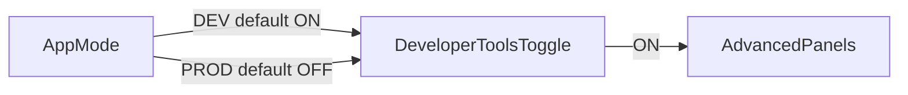

# Developer-Tools Toggle Plan Update

## Required Change

Rename the previous introspection control to **Developer-Tools** and make it the single gate for advanced runtime panels.

## Behavior

- `Developer-Tools = ON` -> show advanced tooling panels
- `Developer-Tools = OFF` -> hide advanced tooling panels
- In `DEV` mode: default ON
- In `PROD` mode: default OFF, user may enable in menu

## Panels Gated By Developer-Tools

- AST panel
- DOM panel
- Raw PGN textarea + input/load area

## Architecture Notes

Advanced panels are controlled by a unified capability check:
- `isDeveloperToolsEnabled = (state.appMode === "DEV") || state.isDeveloperToolsEnabled`

This allows:
- predictable defaults by mode
- explicit user opt-in in PROD
- one switch controlling all advanced runtime insight features

## Planned File Touch Points

- [frontend/src/app_shell/layout.js](frontend/src/app_shell/layout.js)
  - rename menu label/control to Developer-Tools
  - gate AST/DOM/PGN raw section visibility on `isDeveloperToolsEnabled`

- [frontend/src/app_shell/index.js](frontend/src/app_shell/index.js)
  - bind Developer-Tools toggle event
  - persist user preference in localStorage

- [frontend/src/app_shell/app_state.js](frontend/src/app_shell/app_state.js)
  - add/rename state flag to `isDeveloperToolsEnabled`
  - initialize defaults by app mode

- [frontend/src/app_shell/runtime_config.js](frontend/src/app_shell/runtime_config.js)
  - ensure runtime visibility updates honor Developer-Tools gate

- [frontend/data/i18n/en.json](frontend/data/i18n/en.json)
- [frontend/data/i18n/de.json](frontend/data/i18n/de.json)
- [frontend/data/i18n/fr.json](frontend/data/i18n/fr.json)
- [frontend/data/i18n/it.json](frontend/data/i18n/it.json)
- [frontend/data/i18n/es.json](frontend/data/i18n/es.json)
  - replace old introspection labels with Developer-Tools wording

- [doc/architecture-manual.qmd](doc/architecture-manual.qmd)
- [doc/diy-manual.qmd](doc/diy-manual.qmd)
- [doc/user-manual.qmd](doc/user-manual.qmd)
  - reflect Developer-Tools behavior and defaults
