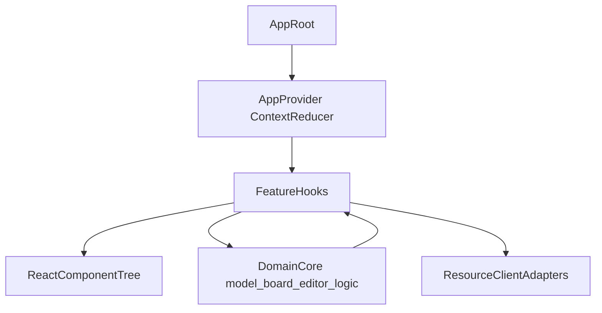

# Full React Migration Plan

## Target Architecture

- Replace imperative DOM wiring/bootstrapping with React component composition.
- Use a single typed app store via React Context + reducer for UI/runtime state transitions.
- Keep domain/model logic (`model/*`, PGN parse/serialize/commands) as framework-agnostic core.
- Migrate integrations (resources, sessions, viewer, editor, board) to React containers + hooks.

## Slice 1: Foundation and State Core

- Create typed reducer/context foundation and action model.
- Keep existing runtime state semantics from:
  - [frontend/src/app_shell/app_state.ts](frontend/src/app_shell/app_state.ts)
  - [frontend/src/bootstrap.ts](frontend/src/bootstrap.ts)
- Add:
  - [frontend/src/state/app_context.tsx](frontend/src/state/app_context.tsx)
  - [frontend/src/state/app_reducer.ts](frontend/src/state/app_reducer.ts)
  - [frontend/src/state/actions.ts](frontend/src/state/actions.ts)
  - [frontend/src/state/selectors.ts](frontend/src/state/selectors.ts)
- Move startup side effects into React lifecycle:
  - initialize runtime config, player store, resource preload, board init through hooks.

## Slice 2: Layout and App Shell Components

- Replace `createAppLayout` DOM construction with React component tree.
- Build component equivalents for shell/menu/devdock/layout split from:
  - [frontend/src/app_shell/layout.ts](frontend/src/app_shell/layout.ts)
  - [frontend/src/app_shell/index.ts](frontend/src/app_shell/index.ts)
  - [frontend/src/app_shell/view_runtime.ts](frontend/src/app_shell/view_runtime.ts)
- Add components:
  - [frontend/src/components/AppShell.tsx](frontend/src/components/AppShell.tsx)
  - [frontend/src/components/MenuPanel.tsx](frontend/src/components/MenuPanel.tsx)
  - [frontend/src/components/DevDock.tsx](frontend/src/components/DevDock.tsx)

## Slice 3: Board and Navigation React Containers

- Convert board area and controls to React components.
- Keep chess/board runtime logic but call via hooks.
- Migrate from imperative wiring in:
  - [frontend/src/board/runtime.ts](frontend/src/board/runtime.ts)
  - [frontend/src/board/navigation.ts](frontend/src/board/navigation.ts)
  - [frontend/src/board/move_lookup.ts](frontend/src/board/move_lookup.ts)
- Add:
  - [frontend/src/components/BoardPanel.tsx](frontend/src/components/BoardPanel.tsx)
  - [frontend/src/hooks/useBoardRuntime.ts](frontend/src/hooks/useBoardRuntime.ts)

## Slice 4: Editor Reactification (Plain/Text/Tree)

- Convert editor rendering host and controls to React.
- Keep plan/reconcile internals initially, then progressively componentize.
- Integrate mode switching (`plain/text/tree`) via reducer + header synchronization.
- Migrate from:
  - [frontend/src/editor/text_editor.ts](frontend/src/editor/text_editor.ts)
  - [frontend/src/editor/text_editor_plan.ts](frontend/src/editor/text_editor_plan.ts)
  - [frontend/src/editor/text_editor_reconcile.ts](frontend/src/editor/text_editor_reconcile.ts)
  - [frontend/src/editor/selection_runtime.ts](frontend/src/editor/selection_runtime.ts)
- Add:
  - [frontend/src/components/EditorPanel.tsx](frontend/src/components/EditorPanel.tsx)
  - [frontend/src/hooks/useEditorRuntime.ts](frontend/src/hooks/useEditorRuntime.ts)

## Slice 5: Sessions and Tabs in React

- Migrate session tabs UI/state orchestration to declarative React.
- Preserve existing session model/store contracts while moving view/update flow into reducer actions.
- Source files to migrate:
  - [frontend/src/game_sessions/session_model.ts](frontend/src/game_sessions/session_model.ts)
  - [frontend/src/game_sessions/session_store.ts](frontend/src/game_sessions/session_store.ts)
  - [frontend/src/game_sessions/tabs_ui.ts](frontend/src/game_sessions/tabs_ui.ts)

## Slice 6: Resources and Resource Viewer Components

- Replace resource viewer/table/tab imperative rendering with React components.
- Integrate resource gateway/client calls through hooks and reducer actions.
- Migrate from:
  - [frontend/src/resources/index.ts](frontend/src/resources/index.ts)
  - [frontend/src/resources/source_gateway.ts](frontend/src/resources/source_gateway.ts)
  - [frontend/src/resources_viewer/index.ts](frontend/src/resources_viewer/index.ts)
  - [frontend/src/resources_viewer/resource_metadata_prefs.ts](frontend/src/resources_viewer/resource_metadata_prefs.ts)
- Add:
  - [frontend/src/components/ResourceViewer.tsx](frontend/src/components/ResourceViewer.tsx)
  - [frontend/src/hooks/useResourceViewer.ts](frontend/src/hooks/useResourceViewer.ts)

## Slice 7: Remove Legacy Bootstrap/Wiring Layer

- Delete or minimize legacy orchestration modules after React equivalents are active.
- Retire:
  - [frontend/src/bootstrap.ts](frontend/src/bootstrap.ts)
  - [frontend/src/app_shell/wiring.ts](frontend/src/app_shell/wiring.ts)
  - remaining direct DOM mutation paths in render pipeline.
- Keep domain/core utilities and adapt imports.

## Slice 8: Hardening and Verification

- Type safety:
  - no `any`, explicit action/state types, typed hooks.
- Behavior checks:
  - move navigation, comment edit, autosave/manual save, resource open/create/save, mode switch plain/text/tree.
- Run after each slice:
  - `cd frontend && npm run typecheck`
  - targeted UI smoke tests.

## Migration Guardrails

- Keep one stable branch of behavior per slice (no long broken phase).
- Maintain canonical resource boundaries (`resource/*`) unchanged.
- Keep model parsing/serialization and PGN command semantics stable; React changes presentation/orchestration only.
- Preserve compatibility of persisted local settings (`locale`, developer tools, panel sizes, metadata prefs).

