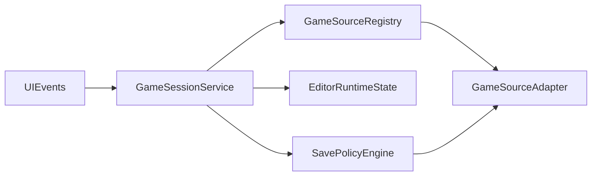
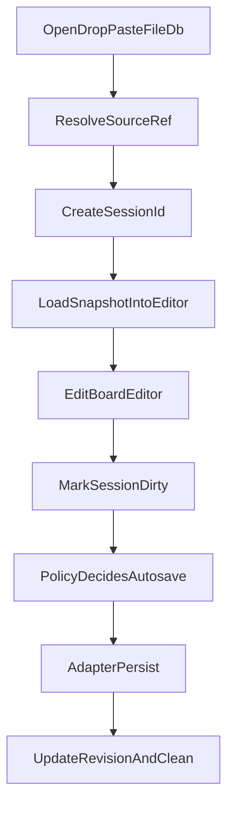

# Refactor Plan: Unified Game Source + Session Architecture

## Goals

- Introduce a single, uniform persistence mechanism for all game sources (file, SQLite DBs, future sources).
- Make tab/session behavior robust: each open game has explicit identity, source linkage, dirty/revision state, and correct save routing.
- Remove architecture smells from oversized composition files and stale single-source wiring.

## Target Architecture

## Core Domain Model (new)

- `GameSession` (in-memory):
  - `sessionId`
  - `sourceRef` (`kind`, `locator`, optional `recordId`/`path`)
  - `revisionToken` (mtime/version/hash depending on source)
  - `snapshot` (pgn/model/move state/history)
  - `dirtyState` (`clean|dirty|saving|error`)
  - `saveMode` (`auto|manual` user-overridable)
- `SourceRef` examples:
  - file: `{ kind: "file", locator: "run/DEV/games", recordId: "foo.pgn" }`
  - sqlite: `{ kind: "sqlite", locator: "run/DEV/db/games.sqlite", recordId: "game_uuid" }`

## Refactoring Scope (files)

- Split composition and feature logic out of [frontend/src/main.js](/Users/stephan/.cursor/worktrees/X2Chess/lzg/frontend/src/main.js).
- Split resource concerns in [frontend/src/resources/index.js](/Users/stephan/.cursor/worktrees/X2Chess/lzg/frontend/src/resources/index.js).
- Keep app-shell wiring focused in [frontend/src/app_shell/wiring.js](/Users/stephan/.cursor/worktrees/X2Chess/lzg/frontend/src/app_shell/wiring.js).
- Keep state declarations in [frontend/src/app_shell/app_state.js](/Users/stephan/.cursor/worktrees/X2Chess/lzg/frontend/src/app_shell/app_state.js).

## Implementation Steps

1. **Introduce source adapter contract + registry**
  - Add `frontend/src/resources/sources/` with:
    - `types.js` (SourceRef, Adapter interface docs)
    - `registry.js` (resolve adapter by `sourceRef.kind`)
    - `file_adapter.js` (current file/Tauri behavior behind adapter)
    - `sqlite_adapter.js` (stub + interface-complete local SQLite adapter)
  - Adapter operations:
    - `load(sourceRef)` -> `{ pgnText, revisionToken, titleHint }`
    - `save(sourceRef, pgnText, revisionToken, options)` -> `{ revisionToken }`
    - `list(context)` -> list openable records
    - `watch?` optional future hook
2. **Create GameSession service**
  - Add `frontend/src/game_sessions/`:
    - `session_model.js` (session object creation/clone/dispose)
    - `session_store.js` (open/switch/close/update/getActive)
    - `session_persistence.js` (save routing + policy decisions)
  - Move tab lifecycle logic out of `main.js` (`capture/apply snapshot`, title derivation, close disposal).
  - Persist session metadata separately from editor runtime state.
3. **Fix save correctness with explicit source identity**
  - Replace global `state.selectedGameFile` save coupling with active session `sourceRef`.
  - Autosave always resolves through active session + adapter.
  - Track `revisionToken` per session and detect write conflicts (at least soft conflict status).
4. **Separate save-policy engine (auto/manual + user override)**
  - Add `save_policy.js` with defaults:
    - default global mode: autosave (per your preference)
    - user can override to manual per source kind/per session
  - Expose simple UI hooks (menu-level toggle and session-level override marker).
  - Prepare fallback policy path if a source later requires manual-only behavior.
5. **Refactor resources component by concern**
  - Keep `resources/index.js` as composition only.
  - Move:
    - runtime config loading -> `resources/runtime_config_service.js`
    - player store -> `resources/player_store_service.js`
    - source interactions -> `resources/source_gateway.js`
  - Remove stale `gameSelect`-specific rendering hooks from resources/wiring.
6. **Refactor `main.js` to pure composition root**
  - Keep only:
    - bootstrap state
    - construct capabilities/services
    - bind events
    - startup call
  - Move feature logic to dedicated modules:
    - DnD/paste open handlers -> `game_sessions/ingress_handlers.js`
    - game tabs rendering/controller -> `game_sessions/tabs_ui.js`
7. **UI contract updates (non-invasive first)**
  - Keep current tabs UX.
  - Add session dirty/saving indicator on tab chip.
  - Add save mode indicator/toggle entry point.
8. **Migration and compatibility layer**
  - Maintain current file-based behavior via `file_adapter` so no regression for DEV run folders.
  - Add adapter-backed compatibility wrappers where old calls still exist, then remove wrappers in a second pass.
9. **Validation and tests**
  - Add targeted tests for:
    - save routing correctness across multiple tabs
    - session close frees snapshots
    - autosave/manual mode behavior
    - adapter contract conformance (file + sqlite stub)
  - Manual test scenarios:
    - open 3 games from mixed sources, edit independently, verify isolated saves
    - switch save mode at runtime and confirm behavior
10. **Documentation updates**
  - Update architecture + user manuals to document:
    - source adapter contract
    - session identity model
    - save policy modes and user controls

## Sequencing

- Phase 1 (Correctness first): Steps 1-4.
- Phase 2 (Modularization): Steps 5-6.
- Phase 3 (UX + docs + hardening): Steps 7-10.

## Acceptance Criteria

- No write operation is possible without active `sessionId + sourceRef` pair.
- Switching tabs never changes another tab’s source binding.
- Save behavior is configurable (default autosave; user-overridable manual mode).
- `main.js` and `resources/index.js` become composition files with reduced size and single responsibility.

