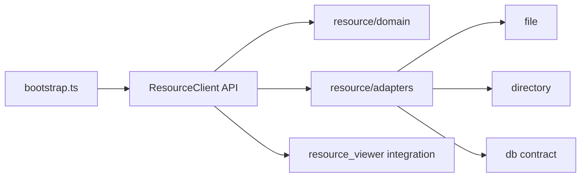

# PGN Resource Library Refactor Plan

## Goal

Create a self-contained PGN resource library under [resource/](/Users/stephan/Workspace/X2Chess/resource) that formally defines what a PGN resource is and exposes a stable API for three equal, first-class kinds:

- `file` resources (single file containing multiple games)
- `directory` resources (folder with one game per file)
- `db` resources (schema-backed)

## Proposed `resource/` Library Structure

- [resource/domain/](/Users/stephan/Workspace/X2Chess/resource)
  - Canonical types: `PgnResourceKind`, `PgnResourceRef`, `PgnGameRef`, `PgnGameEntry`, `PgnLoadResult`, `PgnSaveResult`.
  - Validation/normalization helpers for resource refs and game refs.
- [resource/adapters/](/Users/stephan/Workspace/X2Chess/resource)
  - `file` adapter: multi-game PGN file resource behavior.
  - `directory` adapter: one-game-per-file directory behavior.
  - `db` adapter: schema-backed storage behavior.
  - Adapter registry resolving by canonical kind only.
- [resource/schema/](/Users/stephan/Workspace/X2Chess/resource)
  - Declarative SQL schema files with ordered versions.
  - Canonical tables for resources, games, metadata, and revision/version tracking.
- [resource/migrations/](/Users/stephan/Workspace/X2Chess/resource)
  - Migration runner + applied-version bookkeeping.
  - Idempotent upgrades and startup compatibility checks.
- [resource/client/](/Users/stephan/Workspace/X2Chess/resource)
  - Frontend/backend-agnostic API surface consumed by app integration layers.

## SQL Schema and Versioning Strategy

- Schema ownership stays inside `resource/` and is versioned alongside library code.
- Use an explicit schema version table (for example `schema_version`) managed by migration runner.
- Define migration contract:
  - forward-only migration steps,
  - deterministic ordering,
  - safe re-run behavior,
  - explicit failure reporting for incompatible states.
- `db` resource operations must fail with typed errors when schema is missing/outdated and migration is not permitted.

## Incremental Delivery Slices

1. **Slice A: contracts + client API only**
  - Add canonical domain types and public client interfaces in `resource/`.
  - Frontend still uses existing adapters behind compatibility bridge.
2. **Slice B: file + directory adapters in `resource/`**
  - Port existing file/directory logic into library adapters.
  - Route frontend calls through new client boundary.
3. **Slice C: SQL schema + migration engine**
  - Add `schema/` and `migrations/` modules with version tracking.
  - Land `db` adapter contract and migration bootstrap behavior.
4. **Slice D: frontend decoupling + cleanup**
  - Remove adapter/schema internals from frontend resources modules.
  - Keep frontend as orchestration/UI integration only.
5. **Slice E: compatibility removal**
  - Remove legacy kind aliases and old gateway paths once all consumers are on canonical API.

## Approved Directory Layout

```text
resource/
  README.md
  package.json (or equivalent library build config)

  domain/
    kinds.ts              # file | directory | db
    resource_ref.ts       # PgnResourceRef + validators
    game_ref.ts           # PgnGameRef
    game_entry.ts         # PgnGameEntry + metadata shape
    actions.ts            # load/save/create/list result types + typed errors
    contracts.ts          # PgnResourceAdapter interface

  adapters/
    file/
      index.ts
      file_adapter.ts
      file_locator.ts
    directory/
      index.ts
      directory_adapter.ts
      directory_locator.ts
    db/
      index.ts
      db_adapter.ts
      db_repository.ts

  database/
    schema/
      0001_init.sql
      0002_indexes.sql
      0003_metadata.sql
      schema_manifest.ts
    migrations/
      runner.ts
      ledger.ts           # schema_version table I/O
      steps/
        0001_init.ts
        0002_indexes.ts
        0003_metadata.ts

  client/
    api.ts                # createResourceClient()
    capabilities.ts       # list/load/save/create surface for app use
    kind_router.ts
    compatibility.ts      # temporary legacy mapping (to remove later)

  io/
    fs_gateway.ts
    db_gateway.ts
    path_utils.ts

  tests/
    domain/
    adapters/
    database/
    contract/
```

## Current Baseline (what is coupled today)

- Bootstrap orchestration and direct resource semantics live in [frontend/src/bootstrap.ts](frontend/src/bootstrap.ts) (tab title derivation, resource ref normalization, source selection behavior).
- Resource gateway and adapters live in:
  - [frontend/src/resources/source_gateway.ts](frontend/src/resources/source_gateway.ts)
  - [frontend/src/resources/sources/file_adapter.ts](frontend/src/resources/sources/file_adapter.ts)
  - [frontend/src/resources/sources/pgn_db_adapter.ts](frontend/src/resources/sources/pgn_db_adapter.ts)
  - [frontend/src/resources/sources/sqlite_adapter.ts](frontend/src/resources/sources/sqlite_adapter.ts)
- Resource UI state + metadata preferences are coupled in:
  - [frontend/src/resources_viewer/index.ts](frontend/src/resources_viewer/index.ts)
  - [frontend/src/resources_viewer/resource_metadata_prefs.ts](frontend/src/resources_viewer/resource_metadata_prefs.ts)

## Target Architecture




## Kind Migration Alternatives

- **Alternative A (recommended): compatibility-first migration**
  - Introduce canonical kinds: `file | directory | db` in new domain types.
  - Keep temporary mapping from legacy kinds (`pgn-db`, `sqlite`) to `db`-family adapters behind the facade.
  - Minimize breakage in [frontend/src/bootstrap.ts](frontend/src/bootstrap.ts) and [frontend/src/resources_viewer/index.ts](frontend/src/resources_viewer/index.ts).
- **Alternative B: strict immediate migration**
  - Replace all legacy kinds in one pass.
  - Faster end-state, but higher risk and larger review surface.

## Refactor Steps

1. **Define formal domain contracts (library core in top-level resource/)**
  - Add `resource/domain` modules in [resource/](/Users/stephan/Workspace/X2Chess/resource) for:
    - `PgnResourceKind = "file" | "directory" | "db"`
    - `PgnResourceRef`, `PgnGameRef`, `PgnGameEntry`, `PgnLoadResult`, `PgnSaveResult`
    - `PgnResourceAdapter` interface (`list`, `load`, `save`, `create`, `pick` as supported ops)
  - Move/port shape validation and metadata constants from [frontend/src/resources/sources/types.ts](frontend/src/resources/sources/types.ts) and [frontend/src/resources/sources/pgn_metadata.ts](frontend/src/resources/sources/pgn_metadata.ts) into `resource/domain` + `resource/core`.
2. **Build adapters in resource/ by canonical kind**
  - Keep existing file functionality but expose it through canonical `file` adapter.
  - Introduce explicit `directory` adapter behavior using file-system primitives currently in [frontend/src/resources/sources/file_adapter.ts](frontend/src/resources/sources/file_adapter.ts).
  - Define `db` adapter and its SQL-facing contract in the library (schema-aware; not frontend-owned).
3. **Add SQL schema/versioning inside resource/**
  - Define schema files + version table strategy in `resource/schema` (or equivalent) managed by the library.
  - Add migration runner interfaces and idempotent upgrade path for `db` resources.
  - Keep schema evolution owned by the resource library, not by frontend modules.
4. **Introduce a frontend-facing client boundary**
  - Replace ad-hoc gateway semantics in [frontend/src/resources/source_gateway.ts](frontend/src/resources/source_gateway.ts) with a thin client over the top-level `resource/` library API.
  - Keep frontend persistence/runtime-config integration in [frontend/src/resources/index.ts](frontend/src/resources/index.ts), but remove adapter/schema knowledge from frontend.
5. **Decouple bootstrap from resource internals**
  - Move resource-ref normalization and resource-tab title derivation out of [frontend/src/bootstrap.ts](frontend/src/bootstrap.ts) into resource domain/facade utility modules.
  - Update bootstrap usage to call facade methods only.
6. **Align Resource Viewer to formal contracts**
  - Update [frontend/src/resources_viewer/index.ts](frontend/src/resources_viewer/index.ts) and [frontend/src/resources_viewer/resource_metadata_prefs.ts](frontend/src/resources_viewer/resource_metadata_prefs.ts) to consume `PgnResourceRef/PgnGameEntry` instead of loose objects.
  - Ensure no viewer logic depends on adapter-specific fields.
7. **Migration hardening and compatibility window**
  - If using Alternative A: add temporary `legacyKind -> canonicalKind` conversion in one compatibility module and mark it for removal.
  - Add contract tests for each kind (`file`, `directory`, `db-stub`) validating `list/load/save/create` behavior and error shapes.
8. **Finalize and prune**
  - Remove deprecated `pgn-db/sqlite` naming paths once all call sites use canonical kinds.
  - Keep only canonical resource contracts and adapters in `resources` library.

## Acceptance Criteria

- Top-level `resource/` is the single source of truth for resource contracts, schema, and kinds.
- Frontend code (including [frontend/src/resources](frontend/src/resources)) does not define resource adapter internals or SQL schema.
- Canonical kinds are visible to consumers as `file | directory | db`.
- `file`, `directory`, and `db` each have a formal interface and production-ready adapter behavior (no second-class kind).
- Typecheck stays green and resource viewer can list/open games for `file` and `directory` flows.

